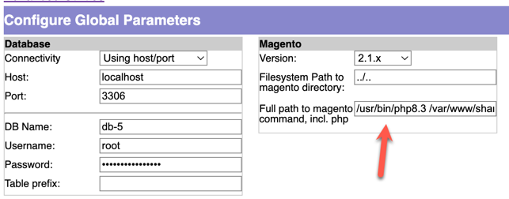

magmi-m2
===

This is a Magento 2 fork of the original "Magento Mass Importer".

The [official Magmi Wiki](http://wiki.magmi.org/) is still hosted at SourceForge.

## Installation
Copy the `magmi` directory onto your server, e.g. the Magento 2 pub directory (or symlink to it). \
If placed in the Magento 2 pub directory, the Magmi web panel will be accessible at `http://yourdomain.com/magmi/web/magmi.php`.

Copy the `magmi.ini.default` file to `magmi.ini` and adjust the settings to your needs.

## Usage
Magmi will ask for basic auth credentials, which are the same as the Magento admin credentials.

Set the full path to the magento command including php here:

## MISC

### PHP 8.3 Support
This fork is compatible with PHP 8.3 and Magento 2.4.7.

### Authentication

Magmi now features shared Magento authentication out of the box.

Upon installing Magmi and visiting the web panel for the first time, the default username and password are both set to "magmi". Once successfully logged in, configure Magmi with the Magento database credentials (under Configure Global Parameters) and then save the settings. Afterwards, one can simply use their Magento administrative (backend) credentials to login to Magmi.